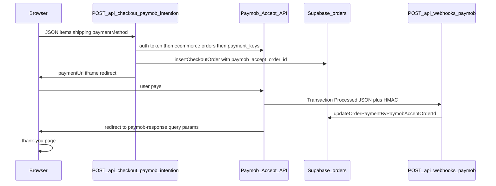

# خطة تفعيل Paymob في Cookie Bite

## كيف يعمل التدفق في الكود الحالي

- إنشاء نية الدفع: [`app/api/checkout/paymob/intention/route.ts`](c:/Users/SRA-DESIGNS/Downloads/COOKIE%20BITE%20CURSOR/app/api/checkout/paymob/intention/route.ts)
- عميل Accept: [`lib/paymob/accept.ts`](c:/Users/SRA-DESIGNS/Downloads/COOKIE%20BITE%20CURSOR/lib/paymob/accept.ts)
- Webhook + HMAC: [`app/api/webhooks/paymob/route.ts`](c:/Users/SRA-DESIGNS/Downloads/COOKIE%20BITE%20CURSOR/app/api/webhooks/paymob/route.ts) و [`lib/paymob/hmac.ts`](c:/Users/SRA-DESIGNS/Downloads/COOKIE%20BITE%20CURSOR/lib/paymob/hmac.ts)
- صفحة عودة المستخدم (قراءة `success` / `order`): [`app/(site)/checkout/paymob-response/page.tsx`](c:/Users/SRA-DESIGNS/Downloads/COOKIE%20BITE%20CURSOR/app/(site)/checkout/paymob-response/page.tsx)
- الواجهة تفتح `paymentUrl` في المتصفح: [`app/(site)/checkout/page.tsx`](c:/Users/SRA-DESIGNS/Downloads/COOKIE%20BITE%20CURSOR/app/(site)/checkout/page.tsx) (`window.location.href`)

---

## 1) حساب Paymob ولوحة التحكم

- حساب **Accept** مفعّل (بطاقة + محفظة إن رغبت) مع **Integration IDs** رقمية لكل قناة.
- نسخ **Secret API Key** (يُستخدم كـ `PAYMOB_API_KEY` في المشروع).
- نسخ **HMAC Secret** الخاص بالمعاملات (يُستخدم كـ `PAYMOB_HMAC_SECRET` في الكود؛ بعض ملفات التوثيق تسميه `PAYMOB_HMAC` — يجب أن تكون القيمة في البيئة تحت الاسم **`PAYMOB_HMAC_SECRET`** لأن الويبهوك ومسار الـ intention يقرآن هذا الاسم فقط).
- ضبط **Transaction processed callback** (Webhook) على عنوان HTTPS عام:
  - إنتاج موصى به: `https://cookie-bite.com/api/webhooks/paymob`
- ضبط **إعادة التوجيه بعد الدفع** (أو ما يعادله في إعدادات الـ integration في Paymob) بحيث يعيد الزائر إلى:
  - `https://cookie-bite.com/checkout/paymob-response`  
  الصفحة تتوقع معاملات مثل `success` / `is_success` و `merchant_order_id` أو `order` / `order_id` ثم تعيد التوجيه إلى `/checkout/thank-you`.
- ملاحظة تقنية: طلب `payment_keys` في [`lib/paymob/accept.ts`](c:/Users/SRA-DESIGNS/Downloads/COOKIE%20BITE%20CURSOR/lib/paymob/accept.ts) **لا يمرّر `redirection_url` في الجسم**؛ لذلك الاعتماد على إعدادات Paymob للـ integration أو على سلوك الـ iframe أمر ضروري حتى تعمل صفحة `paymob-response`.
- رابط الـ iframe في الكود: `https://accept.paymob.com/api/acceptance/iframes/{payment_token}` — إذا غيّرت Paymob نمط الرابط لديك، قد تحتاج تعديل `paymobIframeUrl`.

---

## 2) متغيرات البيئة (الإلزامية للكود)

على الخادم (مثلاً Hostinger) عيّن:

| المتغير | الغرض |
|---------|--------|
| `PAYMOB_API_KEY` | مصادقة `/auth/tokens` |
| `PAYMOB_HMAC_SECRET` | التحقق من توقيع الـ webhook (إلزامي) |
| `PAYMOB_INTEGRATION_ID_CARD` | دفع بالبطاقة (رقم صحيح > 0) |
| `PAYMOB_INTEGRATION_ID_WALLET` | دفع بالمحفظة (رقم صحيح > 0) |

اختياري:

- `PAYMOB_API_URL` — إن وُجدت بيئة API مختلفة؛ الافتراضي `https://accept.paymob.com/api`.

موجود في [`.env`](c:/Users/SRA-DESIGNS/Downloads/COOKIE%20BITE%20CURSOR/.env) كمرجع لكن **غير مقروء في الكود**: `PAYMOB_LIVE`, `PAYMOB_WEBHOOK_URL`, `PAYMOB_RETURN_URL`, `PAYMOB_INTEGRATION_ID_COD` — الـ COD يعمل داخل المشروع بدون Paymob عبر نفس مسار الـ intention عند `paymentMethod === "cod"`.

---

## 3) Supabase والترحيلات

- تشغيل الترحيلات التي تضيف `paymob_accept_order_id` و `paymob_transaction_id` على `orders` (مثل [`supabase/migrations/0002_orders_paymob.sql`](c:/Users/SRA-DESIGNS/Downloads/COOKIE%20BITE%20CURSOR/supabase/migrations/0002_orders_paymob.sql) و `0003` / `0008` حسب تسلسل المشروع).
- إبقاء **`SUPABASE_SERVICE_KEY`** و **`NEXT_PUBLIC_SUPABASE_URL`** صحيحين حتى يُحفظ الطلب قبل الدفع ويُحدَّث بعد الـ webhook.

---

## 4) البنية التحتية والشبكة

- **HTTPS** على النطاق العام (Paymob يرفض غالباً callback غير آمن).
- التأكد أن [`proxy.ts`](c:/Users/SRA-DESIGNS/Downloads/COOKIE%20BITE%20CURSOR/proxy.ts) لا يعيق `POST /api/webhooks/paymob` (الكود يذكر تمرير الويبهوكات).

---

## 5) التحقق من الـ HMAC

- خوارزمية الدمج في [`lib/paymob/hmac.ts`](c:/Users/SRA-DESIGNS/Downloads/COOKIE%20BITE%20CURSOR/lib/paymob/hmac.ts) ثابتة (سلسلة حقول محددة ثم `HMAC-SHA512`). إذا غيّرت Paymob ترتيب الحقول أو الصيغة، سيظهر `Invalid HMAC` في السجلات — عندها يجب مواءاة الدالة مع وثائق Paymob أو نسخة الـ callback الفعلية.

---

## 6) اختبار عملي (يشمل المتصفح)

1. تعبئة `.env` / متغيرات الاستضافة بالقيم أعلاه.
2. `npm run dev` محلياً أو نشر على نطاق HTTPS عام (Webhooks تحتاج عنواناً عاماً؛ للتجربة المحلية غالباً **ngrok** أو نشر staging).
3. في المتصفح: سلة → Checkout → اختيار Card أو Wallet → **Pay with Paymob** → التأكد من الانتقال إلى صفحة Paymob ثم العودة إلى `/checkout/paymob-response` ثم `/checkout/thank-you`.
4. من لوحة Paymob أو سجلات الخادم: إرسال/استقبال webhook واستجابة **200** من `/api/webhooks/paymob`.
5. في Supabase: التحقق من أن الطلب أصبح `payment_status = paid` و`paymob_transaction_id` مملوء عند نجاح المعاملة.

---

## 7) توحيد التوثيق (متابعة اختيارية)

- محاذاة أسماء المتغيرات في [`lib/config/production-lock.ts`](c:/Users/SRA-DESIGNS/Downloads/COOKIE%20BITE%20CURSOR/lib/config/production-lock.ts) والوثائق (`PAYMOB_HMAC` vs `PAYMOB_HMAC_SECRET`) لتجنب نشر مفتاح تحت اسم خاطئ في الإنتاج.
