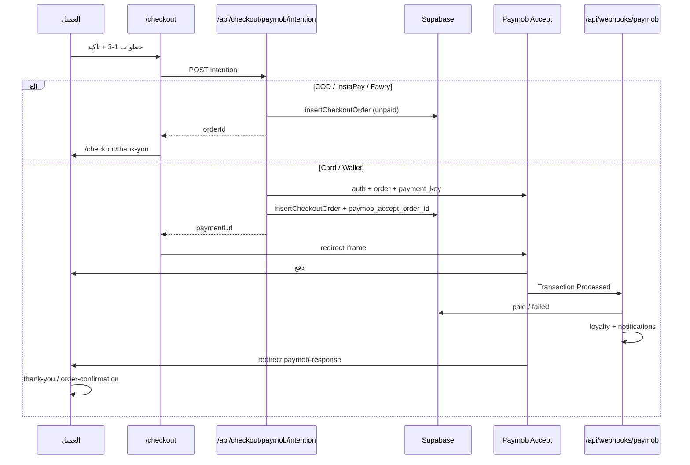

# نظام الدفع في Cookie Bite — مرجع كامل

## 1. نظرة عامة

| البند | التفاصيل |
|--------|-----------|
| **بوابة الدفع الإلكتروني** | [Paymob Accept API](https://developers.paymob.com/paymob-docs) — **ليس Stripe** |
| **العملة** | EGP (جنيه مصري) |
| **نقطة الدخول للعميل** | `/checkout` |
| **API الرئيسي** | `POST /api/checkout/paymob/intention` |
| **تأكيد الدفع (سيرفر)** | `POST /api/webhooks/paymob` |
| **قاعدة البيانات** | Supabase — جدول `orders` + `order_items` |

المبدأ الأساسي: **الأسعار والمجاميع تُحسب على السيرفر فقط** — لا يُوثق بما يرسله المتصفح من أسعار.

---

## 2. طرق الدفع المدعومة

```typescript
// lib/account/payment-method-schema.ts
"card" | "wallet" | "instapay" | "fawry" | "cod"
```

| الطريقة | النوع | السلوك |
|---------|-------|--------|
| **cod** | أوفلاين | دفع عند الاستلام — الطلب يُحفظ مباشرة |
| **instapay** | أوفلاين | تحويل يدوي — الطلب يُحفظ بحالة `unpaid` |
| **fawry** | أوفلاين | دفع فوري يدوي — نفس المسار |
| **card** | أونلاين | Paymob iframe (بطاقة) |
| **wallet** | أونلاين | Paymob iframe (محفظة إلكترونية) |

**ملاحظة:** `instapay` و `fawry` لا يمران عبر Paymob في الكود الحالي — يُسجَّل الطلب فقط ويُفترض الدفع خارج الموقع.

---

## 3. تدفق Checkout (واجهة العميل)

**الملف:** `app/(site)/checkout/page.tsx`

### الخطوات الثلاث

```
[1] الشحن والتوصيل  →  [2] طريقة الدفع  →  [3] المراجعة والتأكيد
```

1. **الشحن:** الاسم، البريد (اختياري)، الهاتف (`01[0125]xxxxxxxx`)، العنوان، المدينة، ملاحظات، جدولة التوصيل (`DeliveryScheduler`).
2. **الدفع:** اختيار طريقة — للمستخدم المسجّل تُحمَّل طرق محفوظة من `/api/account/payment-methods`.
3. **المراجعة:** ملخص السلة، كود الخصم، زر «تأكيد الطلب» يستدعي `onPaymobPrepare()`.

### حساب الإجمالي (على العميل للعرض فقط)

```
الإجمالي = subtotal - discount + deliveryFee + giftWrapFee
```

- **التوصيل:** مجاني إذا `subtotal >= freeShippingThreshold` (من إعدادات المتجر).
- **تغليف هدايا:** 30 جنيه إذا الطلب هدية أو فيه Gift Box.

### عند الضغط على «تأكيد»

```typescript
POST /api/checkout/paymob/intention
{
  items: [{ id, quantity, addons }],
  gift_box?: snapshot,
  shipping: { name, email, phone, address, city, notes },
  paymentMethod: "card" | "wallet" | "cod" | ...,
  promo_code?: string,
  delivery: { ... }
}
```

**النتائج:**

| الحالة | ما يحدث |
|--------|---------|
| أونلاين + Paymob مضبوط | `window.location.href = paymentUrl` (iframe Paymob) |
| أوفلاين (cod/instapay/fawry) | مسح السلة → `/checkout/thank-you?order=...` |
| خطأ | رسالة خطأ ثنائية اللغة |

---

## 4. API نية الدفع — `POST /api/checkout/paymob/intention`

**الملف:** `app/api/checkout/paymob/intention/route.ts`

### 4.1 التحقق والتسعير (سيرفر)

```
الطلب الوارد
    ↓
Zod validation (BodySchema)
    ↓
resolveDeliveryForCheckout() — مواعيد التوصيل والفتحات
    ↓
checkGiftBoxSnapshotAvailability() — إن وُجد Gift Box
    ↓
resolveCheckoutLineItems() — أسعار المنتجات والإضافات من DB
    ↓
validatePromoForCartAsync() أو recovery discount
    ↓
حساب: subtotal, discount, deliveryFee, giftWrap, total
```

### 4.2 مسار الدفع الأوفلاين

```typescript
if (paymentMethod in ["cod", "instapay", "fawry"]) {
  insertCheckoutOrder({ paymentStatus: "unpaid", ... })
  scheduleOrderConfirmed(orderId)
  onOrderCreated() // بريد إن وُجد email
  return { configured: false, orderId, ... }
}
```

### 4.3 مسار Paymob (card / wallet)

```
1. paymobAuthToken(PAYMOB_API_KEY)
2. paymobRegisterEcommerceOrder() → paymobOrderId
3. insertCheckoutOrder({ paymobAcceptOrderId, paymentStatus: "unpaid" })
4. paymobCreatePaymentKey(integrationId) → paymentToken
5. paymobIframeUrl(paymentToken) → paymentUrl
6. return { configured: true, paymentUrl, orderId, ... }
```

**Integration IDs:**

- `PAYMOB_INTEGRATION_ID_CARD` — للبطاقة
- `PAYMOB_INTEGRATION_ID_WALLET` — للمحفظة

---

## 5. مكتبة Paymob — `lib/paymob/`

| الملف | الدور |
|-------|------|
| `accept.ts` | Auth، تسجيل طلب، payment key، iframe URL، refund |
| `hmac.ts` | التحقق من توقيع webhook (SHA-512) |
| `env.ts` | `PAYMOB_HMAC_SECRET` أو `PAYMOB_HMAC` (legacy) |

### تسلسل Accept API

```
POST /auth/tokens                    → auth_token
POST /ecommerce/orders               → paymob order id
POST /acceptance/payment_keys        → payment token
GET  /acceptance/iframes/{token}     → صفحة الدفع للعميل
```

### بنود Paymob

`buildPaymobLineItems()` يبني: منتجات + خصم (سالب) + توصيل + تغليف هدايا.

يُتحقق أن `itemsSum === amountCents` قبل الإرسال.

---

## 6. عودة العميل من Paymob

**الملف:** `app/(site)/checkout/paymob-response/page.tsx`

```
Paymob redirect → /checkout/paymob-response?success=...&order=...
    ↓
نجاح + رقم طلب  →  /order-confirmation?order=...
فشل أو غير واضح  →  /checkout/thank-you?status=failed&order=...
```

**مهم:** تحديث `payment_status` إلى `paid` **لا يعتمد على redirect العميل** — يعتمد على **Webhook**.

---

## 7. Webhook — `POST /api/webhooks/paymob`

**الملف:** `app/api/webhooks/paymob/route.ts`

```
Paymob Transaction Processed Callback
    ↓
verifyPaymobTransactionHmac(transaction, hmac, secret)
    ↓
استخراج paymobOrderId من transaction.order.id
    ↓
updateOrderPaymentByPaymobAcceptOrderId()
    ├─ success=true  → payment_status: "paid", status: "processing"
    └─ success=false → payment_status: "failed", status: "pending"
    ↓
إن أصبح paid لأول مرة:
    ├─ schedulePaymentConfirmed()
    ├─ awardLoyaltyPointsForPaidOrder()
    └─ إن فشل: notifyStoreOrderEvent("payment_failed")
```

**منع التكرار:** إذا تطابق `paymob_transaction_id` والحالة، لا يُعاد تنفيذ المنطق.

---

## 8. حفظ الطلب في قاعدة البيانات

**الملف:** `lib/db/orders.ts` — `insertCheckoutOrder()`

### جدول `orders` (الحقول المرتبطة بالدفع)

| العمود | الوصف |
|--------|--------|
| `payment_method` | cod, card, wallet, instapay, fawry |
| `payment_status` | `unpaid` \| `paid` \| `refunded` \| `failed` |
| `paymob_accept_order_id` | ربط بطلب Paymob (migration 0002) |
| `paymob_transaction_id` | يُملأ من webhook |
| `subtotal_egp`, `delivery_fee_egp`, `discount_amount_egp`, `total_egp` | المجاميع |
| `shipping_address` | JSON (اسم، هاتف، عنوان، guestRef) |

### جدول `order_items`

سطر لكل منتج: `product_id`, `unit_price_egp`, `selected_addons`, `final_total_egp`, إلخ.

### حالات الطلب

```
إنشاء الطلب     → status: "pending", payment_status: "unpaid"
دفع ناجح       → payment_status: "paid", status: "processing"
دفع فاشل       → payment_status: "failed"
استرداد (أدمن) → payment_status: "refunded", status: "refunded"
```

---

## 9. الإشعارات والبريد

| الحدث | التوقيت | الدالة |
|-------|---------|--------|
| تأكيد الطلب | عند الإنشاء | `scheduleOrderConfirmed()` |
| تأكيد الدفع | عند أول `paid` من webhook | `schedulePaymentConfirmed()` |
| بريد `order_created` | عند الإنشاء إن وُجد email | `onOrderCreated()` |

**الجدولة:** Bull+Redis إن وُجد `REDIS_URL`، وإلا طابور DB أو تنفيذ فوري — `lib/notifications/schedule.ts`.

---

## 10. نقاط الولاء

**الملف:** `lib/loyalty/award-order-points.ts`

- تُمنح **فقط** عند أول انتقال إلى `paid` عبر webhook.
- نقطة لكل 10 جنيه؛ ×2 لطلبات `gift_box`.
- ضيوف بدون `user_id` → تُتخطى.

---

## 11. طرق الدفع المحفوظة (الحساب)

**ليست tokenization لبطاقات Paymob** — تفضيلات المستخدم فقط.

| الملف | الدور |
|-------|------|
| `lib/account/payment-method-schema.ts` | أنواع وتحقق |
| `lib/db/payment-methods.ts` | CRUD |
| `app/api/account/payment-methods/route.ts` | GET/POST |
| `supabase/migrations/0058_saved_payment_methods.sql` | الجدول |

تُستخدم في Checkout لاختيار `method_type` مسبقاً (آخر 4 أرقام، رقم محفظة، إلخ).

---

## 12. لوحة الإدارة — المدفوعات

| المسار | الوظيفة |
|--------|---------|
| `/admin/payments` | لوحة المعاملات والتحليلات |
| `GET /api/admin/payments/summary` | ملخص |
| `POST /api/admin/payments/refund` | استرداد |

### الاسترداد

```
1. التحقق: الطلب paid فقط
2. paymobAuthToken + paymobRefundTransaction(transaction_id, amount_cents)
3. تحديث DB: payment_status: "refunded"
4. writeAuditLog()
```

خيار `record_only: true` لتحديث DB بدون استدعاء Paymob (اختبار / تسوية يدوية).

---

## 13. متغيرات البيئة

```env
PAYMOB_API_KEY=
PAYMOB_HMAC_SECRET=          # أو PAYMOB_HMAC
PAYMOB_INTEGRATION_ID_CARD=
PAYMOB_INTEGRATION_ID_WALLET=
PAYMOB_API_URL=              # اختياري — افتراضي accept.paymob.com/api

NEXT_PUBLIC_SUPABASE_URL=
SUPABASE_SERVICE_KEY=
```

بدون مفاتيح Paymob: أوفلاين يعمل؛ card/wallet يُرجع رسالة «مفاتيح ناقصة».

---

## 14. مسار API قديم (بديل)

**`POST /api/orders`** — `app/api/orders/route.ts`

- checkout كامل مع **idempotency key** (UUID).
- **لا يُستدعى** من صفحة `/checkout` الحالية.
- مفيد لعملاء API أو تكاملات أخرى.

الواجهة الحالية تستخدم **`/api/checkout/paymob/intention` فقط**.

---

## 15. مخطط التدفق الكامل



---

## 16. خريطة الملفات

```
app/(site)/checkout/
  page.tsx                    ← واجهة الدفع
  thank-you/page.tsx          ← تأكيد / فشل
  paymob-response/page.tsx    ← redirect من Paymob

app/api/checkout/paymob/intention/route.ts  ← قلب النظام
app/api/webhooks/paymob/route.ts            ← تأكيد الدفع
app/api/admin/payments/refund/route.ts      ← استرداد

lib/paymob/accept.ts | hmac.ts | env.ts
lib/db/orders.ts
lib/checkout/resolve-line-items.ts
lib/account/payment-method-schema.ts

supabase/migrations/
  0002_orders_paymob.sql
  0022_orders_payment_status_ensure.sql
  0058_saved_payment_methods.sql

e2e/checkout-paymob.spec.ts   ← اختبارات smoke
```

---

## 17. ملخص سريع

1. **Paymob Accept** للبطاقة والمحفظة — iframe كلاسيكي.
2. **COD / InstaPay / Fawry** — تسجيل طلب فقط، بدون بوابة.
3. **التسعير على السيرفر** — promo، توصيل، gift box، مخزون.
4. **Webhook + HMAC** هو مصدر الحقيقة لحالة `paid`.
5. **الاسترداد** من الأدمن عبر Paymob refund API.
6. **طرق الدفع المحفوظة** تفضيلات وليست بطاقات tokenized.
